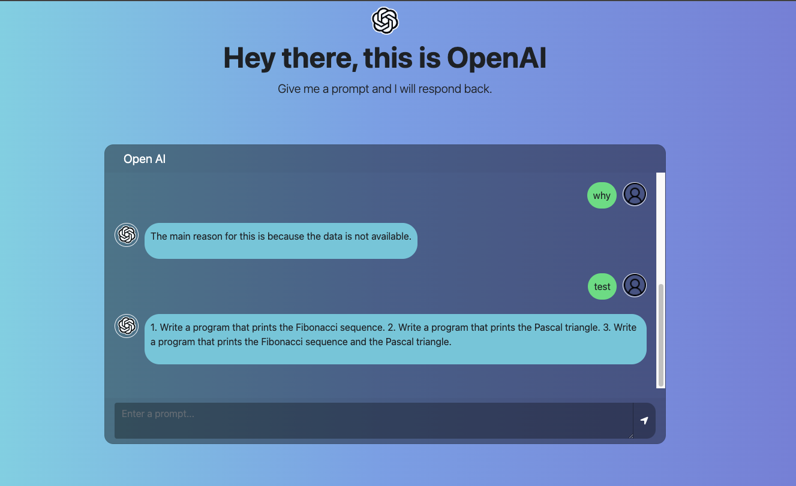

# NBA Games

## Description

Chat with GPT-3. An amazing AI algorithm built by [openai team](https://openai.com/)

## Tech

API [open-ai](https://openai.com/)  
Libraries: Axios, ESLint, bootstrap, jQuery

## Deployed URL

Prod: https://openai-chat.herokuapp.com/

##

Github: https://github.com/Mohmedvaid/open-ai

##

## `npm install`

Installs dependencies

## `npm start`

Runs the app in the development mode.\
Open [http://localhost:3001](http://localhost:3001) to view it in your browser.

The page will reload when you make changes.\
You may also see any lint errors in the console.

## `npm run build`

Builds the app for production to the build folder and deployes to github pages at https://github.com/Mohmedvaid/open-ai

---

## Contributing

- [Mohmedvaid](https://github.com/Mohmedvaid)
